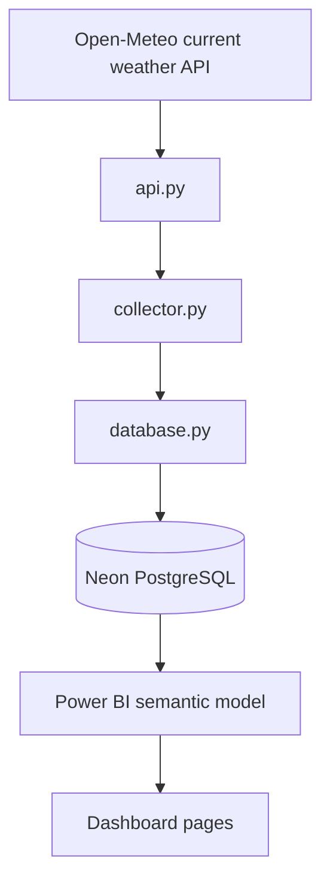

# Architecture

## Data flow

GitHub Actions starts `collector.py` approximately once per hour. Each run stores a full current-condition snapshot and requests the previous six hours of 15-minute observations. PostgreSQL upserts the overlapping window using `(location, weather_time)` as the natural key, allowing a later run to repair missed scheduler events. Power BI supplies the semantic and presentation layers.

## Component ownership

| Component | Responsibility |
|---|---|
| `api.py` | Request and map Open-Meteo's current observation |
| `collector.py` | Orchestrate one collection cycle and report its outcome |
| `database.py` | Connect to Neon and upsert the observation |
| `schema.sql` | Define the canonical PostgreSQL table |
| GitHub Actions | Schedule and monitor cloud execution |
| Power BI | Model, calculate and visualise the observations |

## Resilience model

The GitHub scheduler is treated as a best-effort wake-up mechanism rather than
the source of observation completeness. Each invocation re-requests 24 recent
quarter-hour timesteps. Existing timestamps are updated safely and absent
timestamps are inserted, so ordinary delays and several missed hourly triggers
do not create permanent gaps.

## Configuration and secrets

The collector reads `DATABASE_URL` from the environment. Local development may use an ignored `.env` file copied from `.env.example`. GitHub Actions supplies the same variable through the `DATABASE_URL` repository secret. Credentials must never be committed.

## Duplicate behaviour

When Open-Meteo returns an existing `(location, weather_time)` pair, PostgreSQL updates the existing row rather than creating a second observation. This makes reruns safe while preserving one row per location and weather timestamp.
